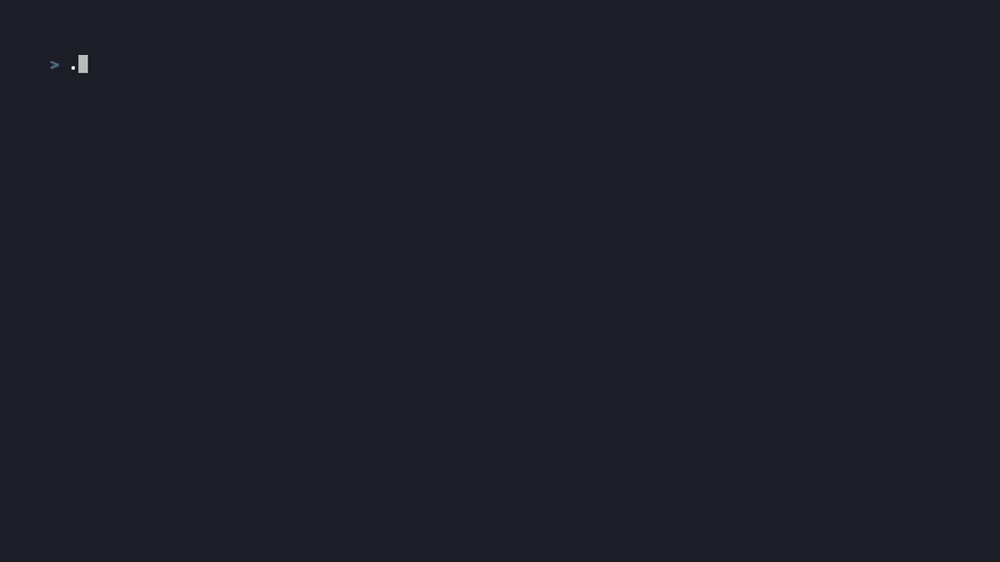

# slay

A Slay the Spire ⚔️ clone that lives in your terminal 👾, written in Rust 🦀

**Play in browser:** [slay.chloe.casa](https://slay.chloe.casa)



The demo you see above was built in just one day! This was an experiment for me to play around with Claude Code, including a modified version of [citypaul's configuration](https://github.com/citypaul/.dotfiles/blob/main/claude) which pushes for TDD and good engineering practices.

## What's in

**Combat**

- [x] Turn-based combat — draw 5, spend energy, discard, repeat
- [x] Statuses: Vulnerable, Weak, Poison, Strength, Dexterity, Entangle, Frail, Combust, Metallicize, Regen, Thorns, Panache, Evolve, Fire Breathing, Mayhem, and more
- [x] 37 Ironclad cards, most with + upgrades (Strike, Bash, Inflame, Impervious, Body Slam, Cleave, Bludgeon, Whirlwind, Reaper, Fiend Fire, ...)
- [x] 20+ enemies with their own move patterns and probabilistic AI — Act 1 regulars, elites (Gremlin Nob, Lagavulin, Sentries), and three bosses (The Guardian, Slime Boss, Hexaghost)
- [x] 23 potions (Fire, Explosive, Block, Strength, Swift, Regen, Liquid Bronze, Duplication, Smoke Bomb, ...) — carry up to 3, discard anytime

**Run structure**

- [x] Branching 15-floor map with probabilistic node placement — Combats, Elites, Rest Sites, Shop, Treasure, Events, Boss
- [x] Map shows your path through visited floors
- [x] Card rewards after combat (pick 1 of 3)
- [x] Rest site: heal 30% HP or upgrade a card
- [x] Gold drops with adaptive pity, persistent across floors
- [x] Shop — buy cards, relics, and potions
- [x] Treasure rooms
- [x] Events — Ssssserpent, Big Fish, Mushrooms, Golden Idol
- [x] 37 relics with real effects (Burning Blood, Orichalcum, Mercury Hourglass, Bag of Preparation, ...)
- [x] Neow's blessings at the start of each run — 4 tiers of upgrades and trade-offs
- [x] Meta-progression: run count, win count, and Neow blessing tier persist across runs

**UI**

- [x] Player HP, block, energy, gold, statuses, relics, and potions in the top bar
- [x] Enemy HP bars, block, intent, and statuses
- [x] Event log panel during combat
- [x] Relic, deck, draw, discard, and exhaust pile overlays
- [x] Help overlay (`?`)
- [x] Room transition wipe animation
- [x] HP damage flash for player and enemies

## How to run

```
cargo run                              # ratatui TUI (default when stdout is a TTY)
cargo run -- --plain                   # plain text, reads commands from stdin
cargo run -- --script path/to/file     # run a script of newline-separated commands
cargo run -- --debug                   # unlocks win / skip / add / relic / potion commands
```

Commands during combat:

- type a number to play a card
- `e` to end your turn
- `use 1` to use your first potion
- `z`/`x`/`c` peek at your draw, discard, and exhaust piles
- `w`/`s` or `↑`/`↓` to scroll through a large hand

Commands on the map:

- `1`/`2` to choose a branch at a combat floor
- `enter` or `1` at single-option floors (Shop, Rest Site, Boss)
- `w`/`s` or `↑`/`↓` to scroll the map

Commands everywhere:

- `d` to view your deck
- `relics` to view your relics
- `?` to open the help overlay
- `esc` to close any overlay

Commands in the shop:

- type a number to buy a card
- `r` to buy the relic
- `p` to buy the potion
- `l` to leave

## Browser (WASM)

The full game also runs in the browser at [slay.chloe.casa](https://slay.chloe.casa). The ratatui TUI compiles to WASM via a custom `WasmBackend` that implements ratatui's `Backend` trait and accumulates ANSI escape sequences instead of writing to a real terminal. xterm.js in the browser consumes those sequences directly — full colour support, cursor positioning, all the visual formatting.

Run state and meta-progression (runs completed, wins, Neow blessing tier) are saved to `localStorage` after every keystroke using RON serialization. Closing the tab mid-run resumes right where you left off.

**Prerequisites**

```
cargo install wasm-pack
```

**Build and serve**

```
make wasm                          # builds pkg into www/pkg/
cd www && python3 -m http.server   # any static server works; file:// does not (ES module imports)
```

After code changes: `make wasm` then refresh the browser.

**Limitations vs native**

- Wipe/flash animations (room transition blackout, HP damage flashes) are disabled — `std::time::Instant::now()` is unavailable on `wasm32-unknown-unknown`
- No debug mode

## What's next

The big things that would make runs feel more like the real game:

- More relics — 37 are live, more are planned. The remaining tiers need card-play counters, HP-change hooks, and a couple of new status types.
- More events — only 4 are implemented; Act 1 has around 17.
- Act 2 and Act 3 — new enemy sets, map layouts, and a final boss.
- Play as other characters, including Silent.

## Legal disclaimer

I built this because I love the original game so much. Slay the Spire is a registered trademark by Mega Crit, LLC. Please support the developers of this amazing game on Steam: https://store.steampowered.com/app/646570/Slay_the_Spire/
